# Key Networking Concepts

## Networking Structure

### Network Types

Four common network types:

| Network Type                         | Definition                                                                                                                                                    |
| ------------------------------------ | ------------------------------------------------------------------------------------------------------------------------------------------------------------- |
| Wide Area Network (WAN)              | A large number of LANs joined together i.e. the Internet                                                                                                      |
| Local Area Network (LAN)             | Internal networks (i.e. home or office)                                                                                                                       |
| Wireless Local Area Network (WLAN)   | Internal networks accessible over Wi-Fi                                                                                                                       |
| Virtual Private Network (VPN)        | Connects multiple network sites to one LAN                                                                                                                    |
| Global Area Network (GAN)            | Global network bigger than WANs, use glass fibers of WANs and interconnect them via international undersea cables or satellite transmission i.e. the Internet |
| Metropolitan Area Network (MAN)      | Regional network that connects several LANs in geographical proximity i.e. multiple LANs                                                                      |
| Wireless Pesonal Area Network (WPAN) | Personal network i.e. bluetooth                                                                                                                               |

There are three main types of VPN, but all three of the same goal of making the user feel as if they were plugged into a different network.

1. **Site-to-Site VPN** - both the client and the server are network devices, typically routers or firewalls, and share entire network ranges. i.e. joining company networks together over the Internet
2. **Remote Access VPN** - involves the client's computer creating a virtual interface that behaves as if it were on the client's network.
3. **SSL VPN** - a VPN that is done within our web browser, typically used for streaming applications or desktop sessions to the browser.

### Networking Topologies

We can divide the network topology area into three areas:

#### 1. Connections

| Wired connections    | Wireless connections |
| -------------------- | -------------------- |
| Coaxial cabling      | Wi-Fi                |
| Glass fiber cabling  | Cellular             |
| Twisted-pair cabling | Satellite            |
| and others           | and others           |

#### 2. Nodes - Network Interface Controller (NICs)

Network nodes are the transmission medium's connection points to transmitters and receivers of electrical, optical, or radio signals in the medium. A node may be connected to a computre, but certain types may have only one microcontroller on a node or may have no programmable device at all.

NICs typically consists of the following:

- Repeaters
- Hubs
- Bridges
- Switches
- Router/Modem
- Gateways
- Firewalls

#### 3. Classifications

These are the types of topologies and can be either physical or logical. Network topologies are divided into the following eight basic types:

1.  Point-to-point
2.  Star
3.  Mesh
4.  Hybrid
5.  Bus
6.  Ring
7.  Tree
8.  Daisy chain

More complex networks can be built as hybrids of two or more of the basic topologies mentioned above.

| Network topology | Description                                                                                                                                                                                                          | Example                                                                                                                                             |
| ---------------- | -------------------------------------------------------------------------------------------------------------------------------------------------------------------------------------------------------------------- | --------------------------------------------------------------------------------------------------------------------------------------------------- |
| Point-to-Point   | Simplest network topology with a dedicated connection between two hosts.                                                                                                                                             | 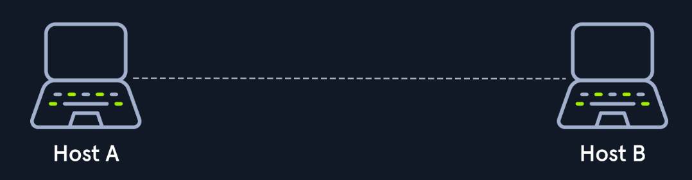                                                            |
| Bus              | All hosts are connected via a transmission medium, there is no central network component that controls processes on it.                                                                                              | 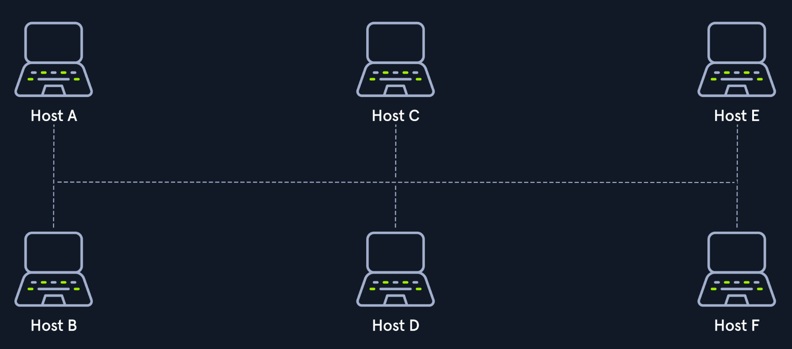                                                                           |
| Star             | Each host is connected to the central network component via a separate link, usually a router, switch, or hub, that handle the forwarding fundtion for data packets                                                  | 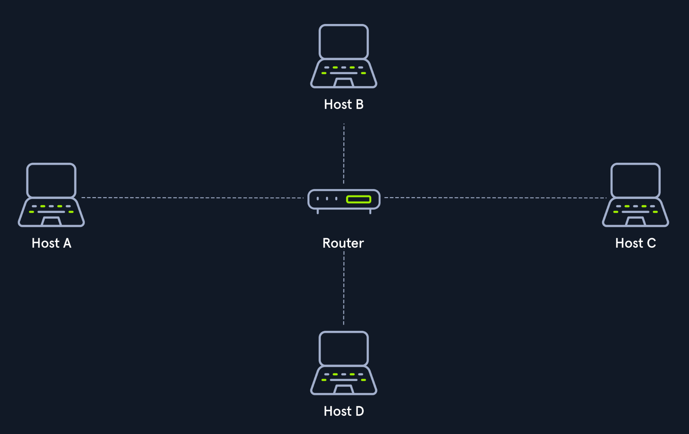                                                                      |
| Ring             | Each host or node is connected to the ring with two cables: one for incoming signals and one for outgoing signals, transmitted in a predetermined direction                                                          | 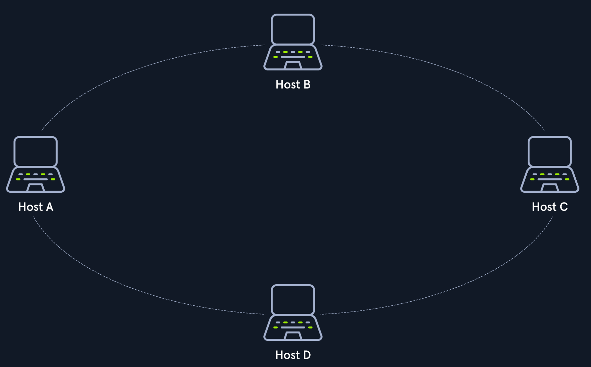                                                                  |
| Mesh             | There are two basic structures, fully meshed and partially meshed. Fully meshed networks are where every component or device is connected to each other and partially meshed is where only some are connected.       | 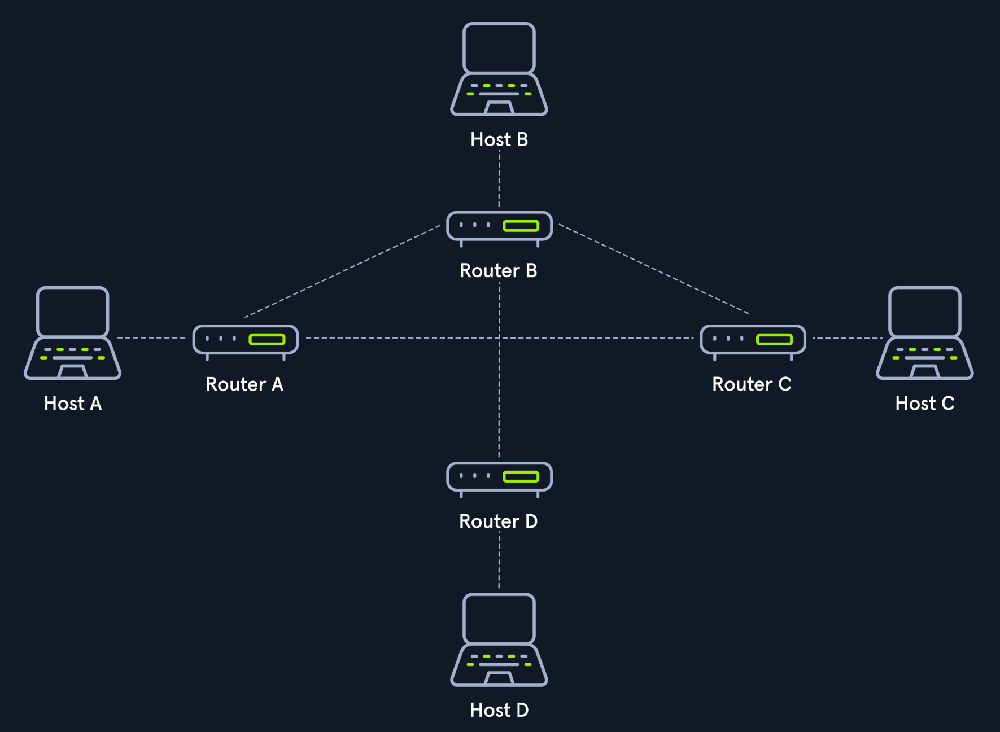                                            |
| Tree             | Extended star topology that has more extensive local networks, often used in larger company buildings.                                                                                                               | 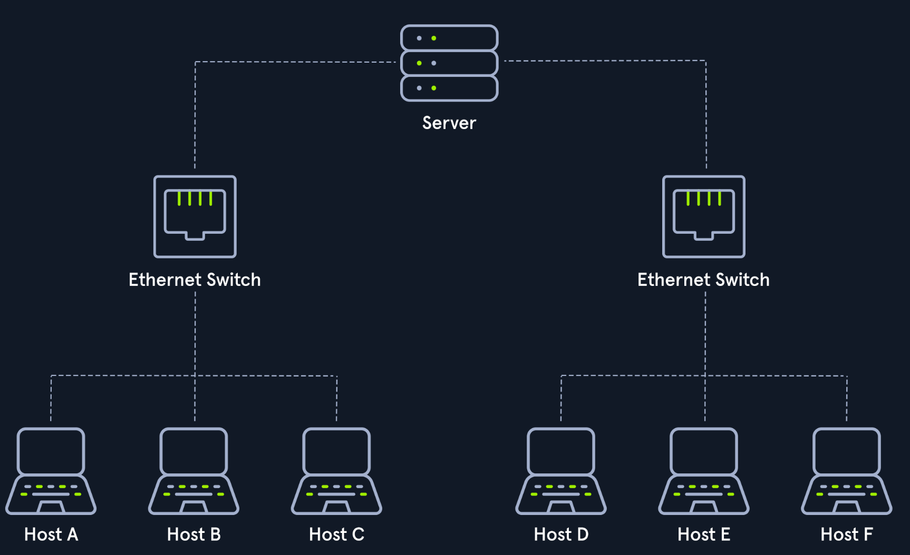 |
| Hybrid           | Combines two or more topologies so that the resulting network does not represent any standard topologies, i.e. a tree network can represent a hybrid topology in which start networks are connected via bus networks | 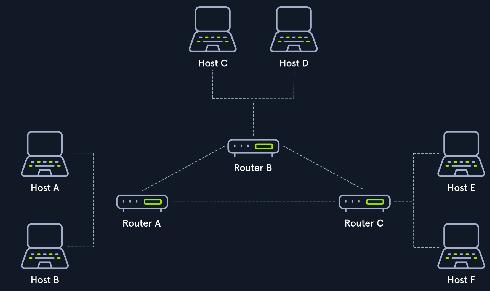                                |
| Daisy chain      | Multiple hosts are connected by placing a cable from one node to another, creating a chain of connections                                                                                                            | 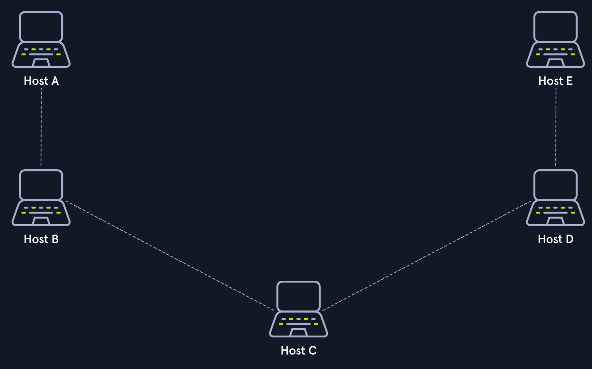                                                |

### Proxies

A proxy is when a device or service sits in the middle of a connection and acts as a mediator. The mediator is the critical piece of information because it means he device in the middle must be able to inspect the contents of the traffic. VPNs are not the same as proxies.

Proxies almost always operate at Layer 7 of the OSI Model. There are many types of proxies, but key ones are:

- Dedicated proxy / forward proxy
- Reverse proxy
- Transparent proxy

#### Dedicated/Forward Proxy

A forward proxy is when a client makes a request to a computer and that computer carries out the request with the proxy in between. i.e. in a corporate network, sensitive computers may need to go through a proxy filter before reaching the Internet to defend against malware.

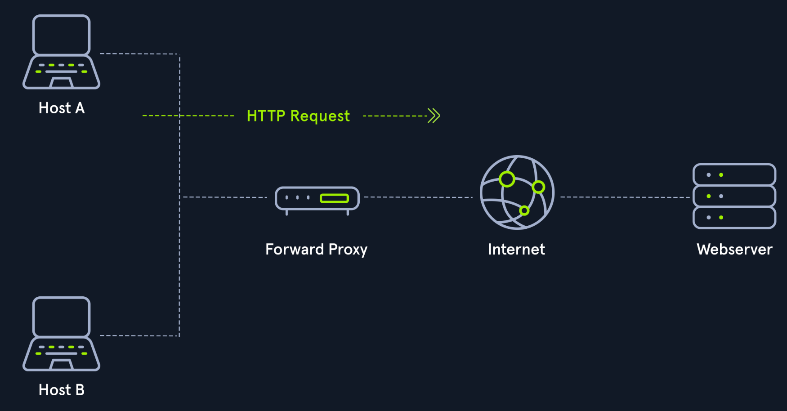

#### Reverse Proxy

Instead of filtering outgoing requests, it filters incoming requests. The most common goal with a reverse proxy is to listen on an address and forward it to a closed-off network. i.e. filtering the amount and type of traffic that gets sent to their webservers.

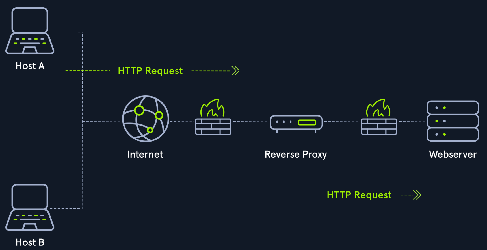

#### (Non-)Transparent Proxy

All these proxy services act either transparently or non-transparently.

With a transparent proxy, the client doesn't know about its existence, it intercepts the client's communication requests to the Internet and acts as a substitute instance.

With a non-transparent proxy, we're informed about its existence.

## Networking Models

Two networking models describe the communication and transfer of data from one host to another, called ISO/OSI model and the TCP/IP model.

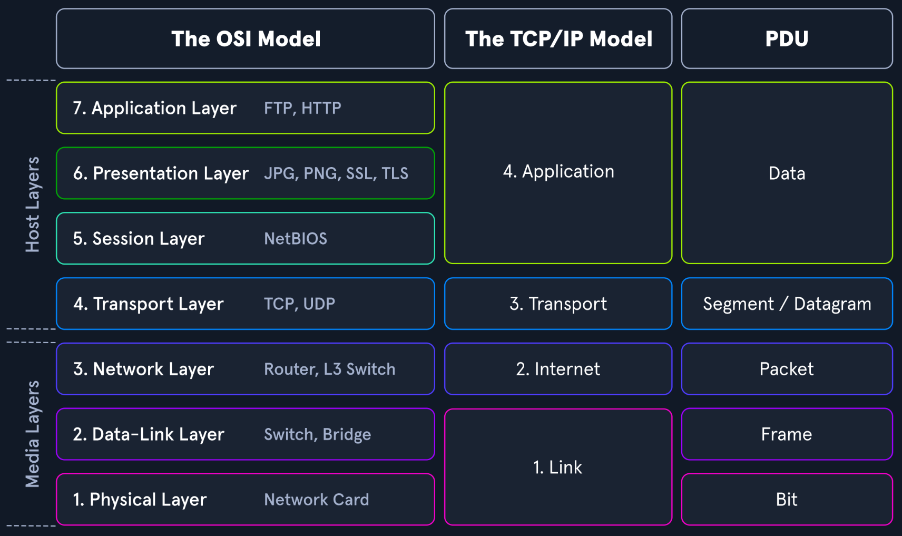

### The OSI Model

The OSI (Open Systems Interconnection) model is a reference model that can be used to describe and define the communication between systems, and has seven individual layers each with clearly separated tasks.

| Layer           | Description                                                                                                                                                                                          |
| --------------- | ---------------------------------------------------------------------------------------------------------------------------------------------------------------------------------------------------- |
| 7. Application  | Among other things, thhis layer controls the input and output of data and provides the application functions.                                                                                        |
| 6. Presentation | Task is to transfer the system-dependent presentation of data into a form independent of the application.                                                                                            |
| 5. Session      | Controls the logical connection between two systems and prevents, for example, connection breakdowns or other problems.                                                                              |
| 4. Transport    | Used for end-to-end control of the transferred data, can detect and avoid congestion situations and segment data streams.                                                                            |
| 3. Network      | Connections are established in circuit-switched networs, and data packets are forwarded in packet-switched networks. Data is transmitted over the entire network from the sender to the receiver.    |
| 2. Data Link    | Central task is to enable reliable and error-free transmissions on the respective medium, for this purpose bitstreams from layer 1 are divided into blocks or frames.                                |
| 1. Physical     | Transmission techniques used are, for example, electrical signals, optical signals, or electromagnetic waves. Through layer 1, the transmission takes place on wired or wireless transmission lines. |

### The TCP/IP Model

TCP/IP (Transmission Control Protocol/Internet Protocol) is a generic term for many network protocols responsible for switching and transporting data packets on the Internet.

| Layer          | Description                                                                                                                                                                                                                    |
| -------------- | ------------------------------------------------------------------------------------------------------------------------------------------------------------------------------------------------------------------------------ |
| 4. Application | Allows applications to access the other layers' services and defines the protocols applciations use to exchange data.                                                                                                          |
| 3. Transport   | Responsible for providing (TCP) sessions and (UDP) diagram services for the Application Layer.                                                                                                                                 |
| 2. Internet    | Responsible for host addressing, packaging, and routing functions.                                                                                                                                                             |
| 1. Link        | Responsible for placing the TCP/IP packets on the network medium and receiving corresponding packets from the network medium. TCP/IP is designed to work independently of the network access method, frame format, and medium. |

The most important tasks of TCP/IP are:

- **Logical Addressing (IP protocol):** IP takes over logical addressing of networks and nodes. Data packets only reach the network where they are supposed to be, and the methods to do so are network classes, subnetting, and CIDR (Classless Inter-Domain Routing).
- **Routing (IP protocol):** For each data packet, the next node is determined in each node on the way from the sender to the receiver. This way, a data packet is routed to its receiver, even if its location is unknown to the sender.
- **Error & Control Flow (TCP protocol):** Sender and receiver are frequently in touch with each other via a virtual connection, therefore control messages are sent continuously to check if the connection is still established.
- **Application Support (TCP protocol):** TCP and UDP ports form a software abstraction to distinguish specific applciations and their communication links.
- **Name Resolution (DNS protocol):** Provides name resolution through Fully Qualified Domain Names (FQDN) in IP addresses, enabling us to reach the desired host with the specified name on the Internet.

### Packet Transfers

In a layered system, devices in a layer exchange data in a different format called a protocol data unit (PDU). Durig the transmission, each layer adds a header to the PDU from the upper layer, which controls and identifies the packet. This process is called encapsulation, and the header and the data together form the PDU for the next layer.

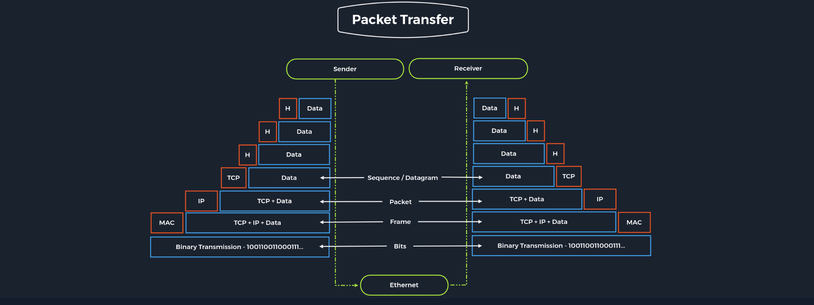

## Addressing

The network layer (layer 3) of OSI controls the exchange of data packets, as these cannot be directlyr outed to the receiver and therefore have to be provided with routing nodes. When sending the packets, addresses are evaluated, and the data is routed through the network from node to node. It is responsible for the following functions:

- Logical addressing
- Routing

The most used protocols on this layer are:

- IPv4 / IPv6
- IPsec
- ICMP
- IGMP
- RIP
- OSPF

It ensures the routing of packets from source to destination within or outside a subnet.

### IPv4 Addresses

Each host in the network located can be identified by the Media Access Control address (MAC address). Addressing on the Internet is done via the IPv4 / IPv6 address, which is made up of the network address and the host address. We can imagine the representation of MAC and IPv4 / IPv6 addresses as follows:

- **IPv4 / IPv6** describes the unique postal address and district of the receiver's building.
- **MAC** describes the exact floor and apartment number of the receiver.

It is possible for a single IP address to address multiple receivers (broadcasting) or for a device to respond to multiple IP addresses. However, it must be ensured that each IP address is assigned only once within the network.

### IPv4 Structure

IPv4 addresses consist of a 32-bit binary number combined into 4 bytes consisting of 8-bit groups (octets) ranging from 0-255. These are converted into more easily readable decimal numbers, separated by dots and represented as dotted-decimal notation.

An IPv4 address can look like this:

| Notation | Presentation                            |
| -------- | --------------------------------------- |
| Binary   | 0111 1111.0000 0000.0000 0000.0000 0001 |
| Decimal  | 127.0.0.1                               |

The IPv4 format allows 4,294, 967, 296 unique addresses. The IP address is divided into host part and a network part. The router assigns the host part at home or by an administrator, and the respective network administrator assigns the network part.

For the first octet 127, you can work out the decimal to binary like so:

| Values | Binary |
| ------ | ------ |
| 128    | 0      |
| 64     | 1      |
| 32     | 1      |
| 16     | 1      |
| 8      | 1      |
| 4      | 1      |
| 2      | 1      |
| 1      | 1      |

So the binary for 127 is 0111111. This works the other way too - you can add the values to make 127 i.e. 64+32+16+8+4+2+1 = 127.

### Subnet Mask

In the past, the IP network blocks were divided into classes A - E:

| Class | Network Address | First Address | Last Address    | Subnetmask    | CIDR      | Subnets   | IPs           |
| ----- | --------------- | ------------- | --------------- | ------------- | --------- | --------- | ------------- |
| A     | 1.0.0.0         | 1.0.0.1       | 127.255.255.255 | 255.0.0.0     | /8        | 127       | 16,77,214 + 2 |
| B     | 128.0.0.0       | 128.0.0.1     | 191.255.255.255 | 255.255.0.0   | /16       | 16,384    | 65,534 + 2    |
| C     | 192.0.0.0       | 192.0.0.1     | 223.255.255.255 | 255.255.255.0 | /24       | 2,097,152 | 254 + 2       |
| D     | 224.0.0.0       | 224.0.0.1     | 239.255.255.255 | Multicast     | Multicast | Multicast | Multicast     |
| E     | 240.0.0.0       | 240.0.0.1     | 255.255.255.255 | reserved      | reserved  | reserved  | reserved      |

The division of an address range of IPv4 addresses into several smaller address ranges is called subnetting. A subnet is a logical segment of a network that uses IP addresses with the same network address.

The bits in the host part can be changed to the first and last address. The first address is the _network address_ and the last address is the _broadcast address_ for the respective subnet.

### CIDR

Classless Inter-Domain Routing (CIDR) is a method of representation and replaces the fixed assignment between IPv4 address and network classes (A, B, C, D, E). The division is based on the subnet mask or the CIDR suffix, which allows the bitwise division of the IPv4 address space and thus into subnets of any size.

The CIDR suffix indicates how many its from the beginning of the IPv4 address belong to the network. It is a notation that represents subnet mask by specifying the number of 1-bits in the subnet mask.

For example, an IPv4 address of 192.168.10.39 and subnet mask 255.255.255.0 have a CIDR of 192.168.10.39/24

### MAC Addresses

Each host in a network has its own 48-bit (6 octets) MAC address, represented in hexadecimal format, and it is the physical address for our network interfaces. There are several different standards for the MAC address:

- Ethernet (IEEE 802.3)
- Bluetooth (IEEE 802.15)
- WLAN (IEEE 802.11)

This is because the MAC address addresses the physical connection (network card, bluetooth, or WLAN adapter) ofa host.

Example of a MAC address:

| Representation | 1st Octet | 2nd Octet | 3rd Octet | 4th Octet | 5th Octet | 6th Octet |
| -------------- | --------- | --------- | --------- | --------- | --------- | --------- |
| Binary         | 11011110  | 10101101  | 10111110  | 1110111   | 00010011  | 00110111  |
| Hex            | DE        | AD        | BE        | EF        | 13        | 37        |

The first half is the Organization Unique Identifier (OUI) for the respective manufacturers. The last half is called the Individual Access Part or Network Interface Controller (NIC), which the manufacturer assigns.

When an IP packet is delivered, it must be addressed on layer 2 to the destination host's physical address or to the router. Each packet has a sender and receiver address. Address Resolution Protocol (ARP) is used in IPv4 to determine the MAC addresses associated with the IP addresses.

#### MAC Address Attack Vectors

MAC addresses can be changed/manipulated or spoofed, so they should not be relied upon as the sole means of security or identification. Network administrators should implement additional security measures, such as network segmentation and strong authentication protocols to protect against potential attacks.

There are several attack vectors that can be exploited using MAC addresses:

- **MAC spoofing** involves altering the MAC address of a device to match that of another device, typically to gain unauthorised access.
- **MAC flooding** involves sending many packets with different MAC addresses to a network switch, causing it to reach its MAC address table capacity and prevent it from functioning properly.
- **MAC address filtering** - some networks to be configured only to allow access to devices with specific MAC addresses that could be exploited by attempting to gain access using a spoofed MAC address.

#### Address Resolution Protcol

ARP is a network protocol which is an important part of the network communication used to resolve a network layer (layer 3) IP address to a data link layer (layer 2) MAC address. It allows devices to send and receive data using MAC addresses rather than IP addresses.

ARP spoofing, also known as ARP cache poisoning or ARP poison routing, is an attack that can be done using tools like Ettercap or Cain & Abel to send falsified ARP messages over a LAN. The goal is to associate our MAC address with the IP address of a legitimate device on the company's network, effectively allowing us to intercept traffic intended for the legitimate device.

### IPv6 Addresses

IPv6 is the successor of IPv4 and is 128 bit long. The prefix defines the host and network parts.

## TCP vs UDP

Transmission Control Protocol (TCP) is a connection-oriented protocol that establishes a virtual connection between two devices before transmitting data by using a three-way handshake. This connection is maintained until the data transfer is complete, and the devices can continue to send data back and forth as long as the connection is active. i.e. requesting a website, the browser sends an HTTP request to the server hosting the website using TCP.

In contrast, the User Datagram Protocol (UDP) is a connectionless protocol, which means it does not establish a virtual connection before transmitting data. Instead, it sends the data packets to the destination without checking to see if they were received. i.e. used for streaming videos or music.

## Wireless Networks

Wireless networks use radio frequency (RF) technology to transmit data between devices. Each device has a wireless adapter that converts data into RF signals and sends them over the air.

The strength of the RF signal and the distance it can travel are influenced by factors such as the transmitter's power, the presence of obstacles, and the density of RF noise in the environment. To ensure reliable communication, WiFi networks use techniques such as spread spectrum transmission and error correction to overcome these challenges.

## Virtual Private Networks

A Virtual Private Network (VPN) is a technology that allows a secure and encrypted connection between a private network and a remote device. VPN typically uses the ports TCP/1723 for point-to-point tunneling protocol (PPTP) VPN connections and UDP/500 for IKEv1 and IKEv2 connections. The VPN client and server uses these ports to establish and maintain the VPN connection. At the TCP/IP layer, a VPN connection typically uses the Encapsulating Security Payload (ESP) protocol to encrypt and authenticate the VPN traffic. This allows the VPN client and server to exchange data over the public internet securely.

### IPsec

Internet Protocol Security (IPsec) is a network security protocol that provides encryption and authentication for internet communications. It encrypts the data payload of each IP packet and adds an authentication header (AH) used to verify the integrity and authenticity of the packet. IPsec uses two protocols:

1. **Authentication Header (AH):** Provides integrity and authenticity for IP packets, but not authentication.
   2A cybersecurity learning portfolio featuring CTF write-ups, security fundamentals, and research into emerging areas such as AI and LLM security.
2. **Encapsulating Security Payload (ESP):** Provides encryption and optional authentication for IP packets.

IPsec can be used in two modes:
| Mode | Description|
|-|-|
|Transport Mode | IPsec encrypts and authenticates the data payload of each IP packet but does not encrypt the IP header. Typically used to secure end-to-end communication between two hosts. |
| Tunnel Mode | IPsec encrypts and authenticates the entire IP packet, including the IP header. Typically used to create a VPN tunnel between two networks. |
