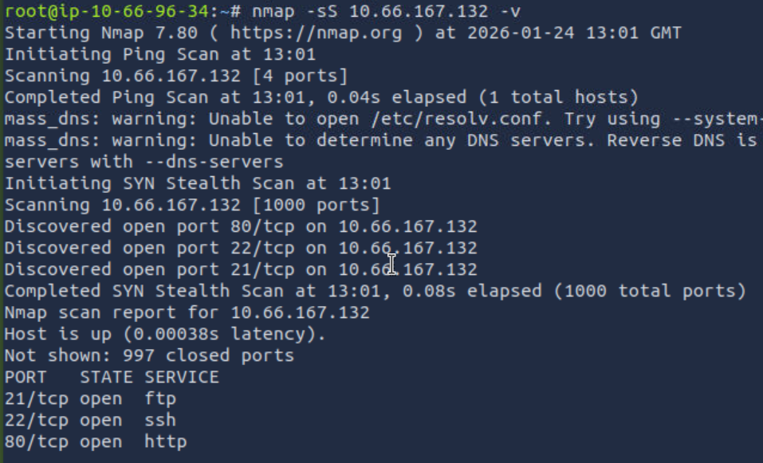
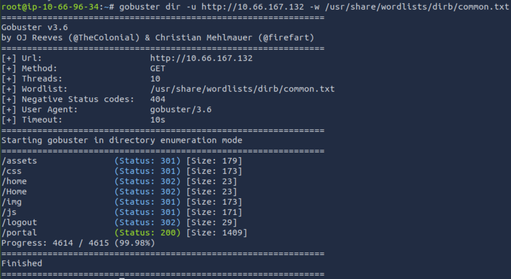
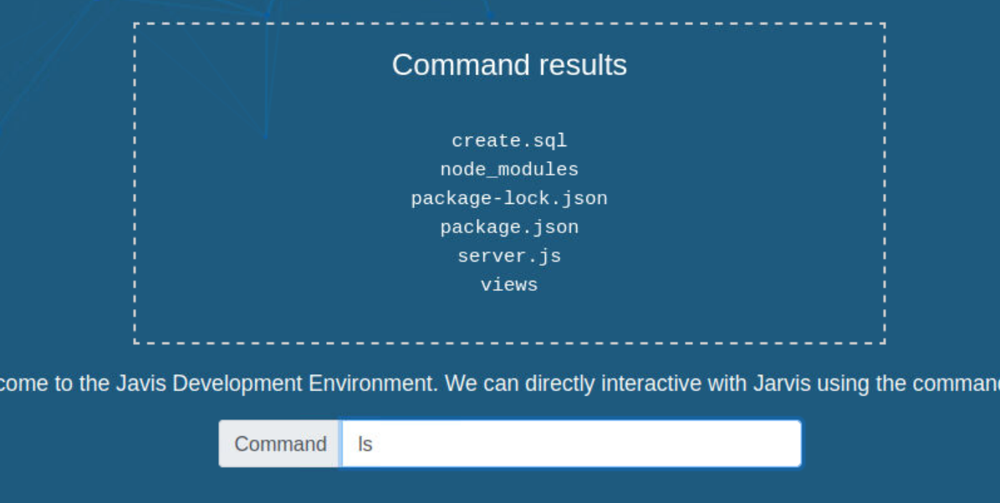
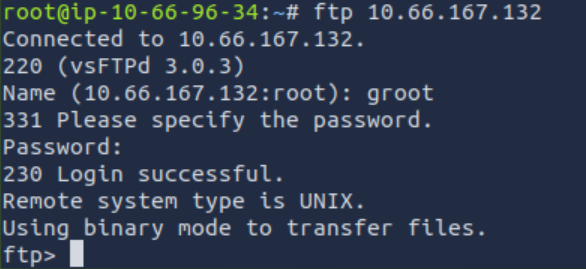

# Avengers Blog | Beginner Web Exploitation Walkthrough

_A scructured introduction to web enumeration, SQL injection, and remote code execution._

## Overview

Platform: TryHackMe
Difficulty: Easy
Category: Web Application Security, Enumeration, Linux

This room provides a guided introduction to the core stages of a web-based CTF, including web enumeration, authentiation bypass via SQL injection, and remote code execution leading to a Linux shell.

## Learning Objectives

- Understand the typical structure of a beginner web CTF
- Practice HTTP enumeration (cookies and headers)
- Identify and exploit a basic SQL injection vulnerability
- Gain remote code execution through a web application
- Apply basic Linux post-exploitation techniques

## Initial Enumeration

An initial nmap scan was performed to identify exposed services on the target.

Key findings:

- FTP (21) OPEN
- SSH (22) OPEN
- HTTP (80) OPEN

Given the presence of a web server, HTTP enumeration was prioritised as it commonly exposes authentication mechanisms, user input, and misconfigurations.

## Web Enumeration

The web application was manually browsed to understand its structure and behaviour.

During enumeration:

- HTTP headers were inspected to understand server behaviour
- Cookies were reviewed to identify session-related data
- Page source was examined for comments or hidden functionality

## Directory Enumeration

Directory brute-forcing was performed to identify hidden endpoints.

This revealed additional pages not linked from the main site, including a login portal.

These endpoints expanded the attack surface by introducing authentication functionality.

## Authentication Bypass via SQL Injection

The login portal was vulnerable to SQL injection due to unsanitised user input.

By injecting a tautological SQL condition into the login request (placing "' or 1=1--" in the username/password fields), authentication controls were bypassed, granting access as an administrative user.

## Remote Code Execution

Post-authentication functionality allowed user-supplied input to be executed on the server.

This vulnerability was levereaged to execute system commands, confirming the ability to run arbitrary code on the host.

## FTP Enumeration

The FTP service was accessed to enumerate available files. A username and password was exposed on the frontend that allowed access.

A flat file containing useful information was retrieved, reinforcing the importance of service enumeration beyond the web layer.

## Linix Post-Exploitation

Once command execution was achieved, basic Linux enumeration was performed to understand the system environment and retrieve the required information.

This stage reinforced familiarity with Linux file systems and common commands.

## Key Takeaways

- Enumeration is the most important phase of a CTF
- Web applications often expose multiple attack vectors
- SQL injection remains a common and impactful vulnerability
- Small misconfigurations can chain into full system compromise
- Understanding fundamentals is more valuable than memorising exploits

## Mitigations

- Use prepared statements to prevent SQL injection
- Validate and sanitise all user input
- Restrict command execution functionality
- Disable unnecessary services such as anonymous FTP
- Apply the principle of least privilege

## Personal Reflection

This room helped solidify my understanding of how individual techniques (enumeration, SQL injection, and RCE) connect into a complete attack chain. It reinforced the importance of methodical testing over random exploitation.
