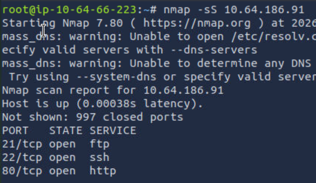
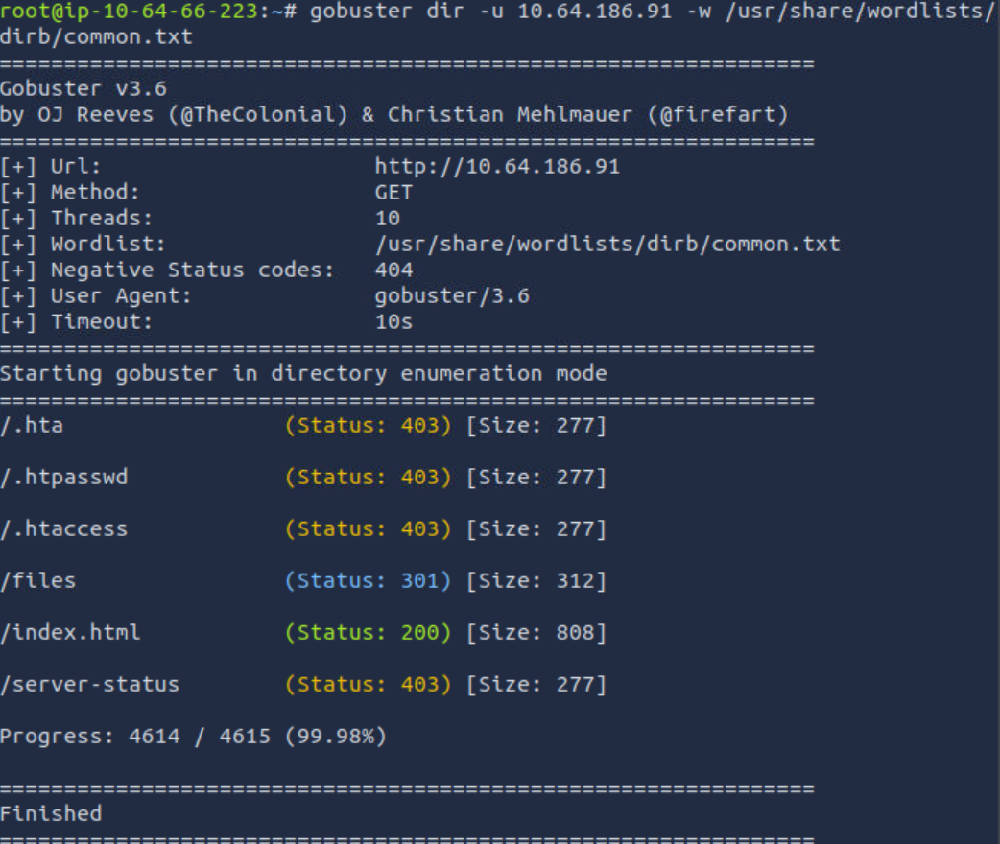
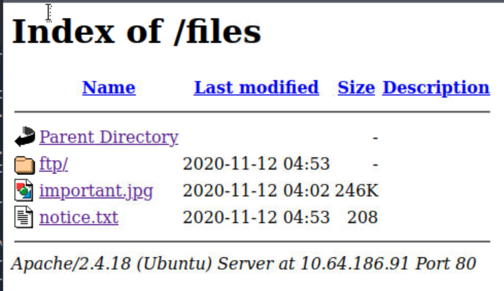
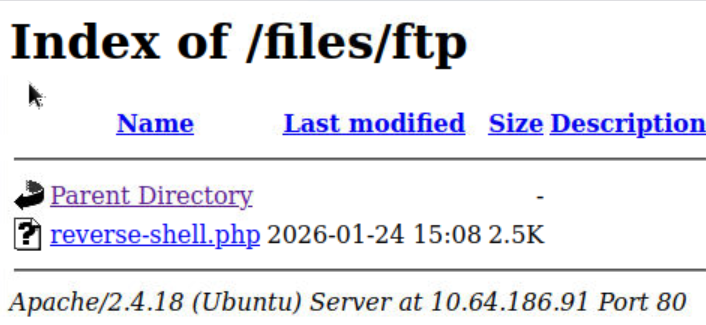
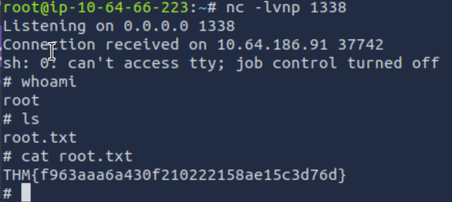

# Startup | Beginner Web Exploitation Walkthrough

## Overview

Platform: TryHackMe
Difficulty: Easy
Category: Web Application Security, Enumeration, Linux

This room simulates a beginner-friendly web exploitation scenario. The objective is to enumerate exposed services, identify misconfigurations, gain initial access to the system, and ultimately retrieve the startup’s secret ingredient for their spicy soup recipe, along with additional flags hidden within the system.

## Initial Enumeration

An initial nmap scan was performed to identify exposed services on the target.

Key findings:

- FTP (21) OPEN
- SSH (22) OPEN
- HTTP (80) OPEN

Given the presence of an HTTP service, web enumeration was prioritised, as web applications often expose additional attack surface through user input, hidden endpoints, or authentication mechanisms.

## Directory Enumeration

Directory brute-forcing was performed against the web server to identify hidden or unlinked endpoints.

This enumeration revealed several additional pages, including a login portal and a /files directory that was not directly linked from the homepage.

These discovered endpoints expanded the attack surface by introducing both authentication functionality and access to potentially sensitive files.

Navigating to the `/files` endpoint revealed directory contents accessible via the browser.

## FTP Authentication Brute Force

Based on the presence of an FTP service and the /files directory, FTP enumeration was performed next.

Testing common configurations revealed that the FTP server allowed anonymous authentication using:

- Username: `anonymous`
- Password: `password`

This misconfiguration granted access to the FTP server without valid credentials, allowing interaction with hosted files.

## PHP Reverse Shell

With write access available via FTP, a PHP reverse shell was uploaded to the server.

Once uploaded, the shell was executed through the web server, resulting in remote command execution on the target machine.

This provided an initial foothold on the system.

## Information Gathering

After gaining command execution, further enumeration was performed on the system.

Findings:

- The secret ingredient for the spicy soup recipe was retrieved:
  `love <3`
- An interesting directory named `incidents` was discovered, containing a `.pcapng` file

The packet capture file was downloaded and analysed using Wireshark. Following the TCP stream revealed credentials for a user named `lennie`.

These credentials were reused to establish an SSH connection to the system as `lennie`.

Further enumeration revealed a script (`planner.sh`) that executed another script (`print.sh`) with elevated privileges. By modifying `print.sh` to include a reverse shell and executing `planner.sh`, root access was obtained.

## Key Takeaways

- Enumeration is the most critical phase of a CTF and often reveals multiple attack pahts
- Anonymous FTP access can quickly lead to full system compromise
- Web directory enumeration frequently exposes hidden functionality
- Packet capture files can contain highly sensitive information such as credentials
- Misconfigured scripts running with elevated privileges are a common privilege escalation vector
- Chaining small misconfigurations can result in total system takeover

## Mitigations

- Disable anonymous FTP access or restrict it to read-only if required
- Enforce strong authentication and credential management practices
- Remove sensitive files such as packet captures from production systems
- Validate and restrict file upload functionality
- Ensure scripts running with elevated privileges are properly secured and not writable by lower-privileged users
- Apply the principle of least privilege across services and users

## Personal Reflection

This room reinforced the importance of methodical enumeration and demonstrated how multiple low-severity misconfigurations can be chained together to achieve full system compromise. It helped solidify my understanding of how web enumeration, FTP misconfigurations, and Linux privilege escalation techniques fit together in a realistic attack flow.
