# Linux Fundamentals

## Overview

Difficulty: Easy  
Skills Tested: Enumeration, SMB exploitation, privilege escalation

## Commands

| Command    |                        Description                         |
| ---------- | :--------------------------------------------------------: |
| echo       |              Output any text that we provide               |
| whoami     |      Find out what user we're currently logged in as!      |
| ls         |        List files and folders in current directory         |
| cd         |                      Change directory                      |
| cat        |            View contents of file (concatenate)             |
| pwd        |                  Print working directory                   |
| find -name |                    Find file with name                     |
| wc         | Word count - can use flags -l (line), -w (word), -c (byte) |
| grep       |              Search file for specific content              |
| man        |      Used to print manual for command or application       |
| touch      |                        Create file                         |
| mkdir      |                      Create a folder                       |
| cp         |                   Copy a file or folder                    |
| mv         |                   Move a file or folder                    |
| rm         |                  Remove a file or folder                   |
| file       |                Determine the type of a file                |
| su         |                        Switch user                         |
| nano       |   Create or edit a file using nano terminal text editor    |
| wget       |              Download files from web via HTTP              |

## Linux Operators

| Operator | Description                                                                                                                                      |
| -------- | ------------------------------------------------------------------------------------------------------------------------------------------------ |
| &        | Run commands in the background of your terminal                                                                                                  |
| &&       | Combine multiple commands together in one line                                                                                                   |
| >        | This operator is a redirector - meaning that we can take the output from a command (such as using cat to output a file) and direct it elsewhere. |
| >>       | This operator does the same function of the > operator but appends the output rather than replacing (meaning nothing is overwritten).            |

## Using SSH to Login

The syntax to use SSH requires two things:

1. The IP address of the remote machine
2. Correct credentials to a valid account to login with on the remote machine

e.g. ssh tryhackme@10.10.10.10

## Flags and Switches

- Arguments are identified by a hyphen and a certain keyword known as flags or switches
- Can access list of options by using [command] --help
- Manual pages contain documentation for commands and applications i.e. man ls

## Permissions

A file or folder can have a couple of characteristics that determine both what actions are allowed and what user or group can perform the given action, such as:

- Read
- Write
- Execute

### Switching User

Two things are required to facilitate user account transition:

1. The user to switch to i.e. su user2
2. The user's password

### Converting Symbolic Permissions to Numbers

| Permission  | Value |
| ----------- | ----- |
| Read `r`    | 4     |
| Write `w`   | 2     |
| Execute `x` | 1     |

**Example: rwxrwxrwx**

| Group  | Permissions | Calculation | Value |
| ------ | ----------- | ----------- | ----- |
| Owner  | `rwx`       | 4+2+1       | 7     |
| Group  | `rwx`       | 4+2+1       | 7     |
| Others | `rwx`       | 4+2+1       | 7     |

### Why This Matters

Understanding numeric permissions is important because:

- Many Linux commands use numeric values e.g. chmod 755 file
- You can quickly identify security risks
- You can control who can access sensitive files

**Example**
`chmod 750 system_overview.txt`
This means:

- Owner: full access
- Group: read + execute
- Others: no access

## Common Directories

### /etc

This root directory is one of the most important root directories on your system. Commonplace location to store system files used by the operating system.

- Contains `sudoers` file which has list of users & groups that have permission to run sudo or root user commands
- Also contains `passwd` and `shadow` files, special for Linux as they show how the system stores passwords for each uers in encrypted formatting called sha512

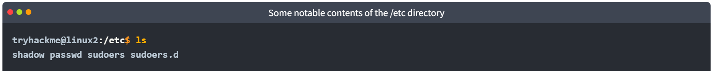

### /var

Stores data that is frequently accessed or written by services or applications running on the system. Log files from running services and applications are written here `/var/log`, or other data that is not necessarily associate dwith a specific user i.e. databases, etc.

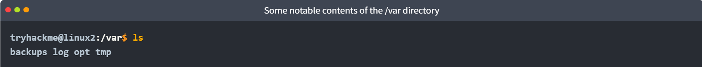

### /root

Actually the home for the root system user.

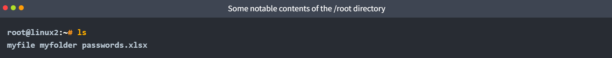

### /tmp

Unique root directory found on a Linux install, which is volatile and used to store data that only needs to be accessed once or twice. Once the computer is restarted, the contents of this folder are cleared out.

Useful for pentesting, as any user can write to this folder by default, meaning once we have access to a machine it serves as a good place to store things like our enumeration scripts.

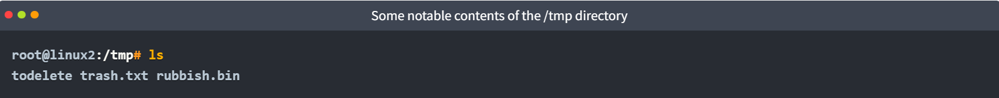

## Terminal Text Editors

Can store text in files using `echo` and the pipe operators (`>` and `>>`), but not an efficient way to handle files with multiple lines. Terminal text editors such as `nano` and `VIM` can be used to edit files with multiple lines.

### Nano

To create or edit a file using nano, just use `nano filename`.

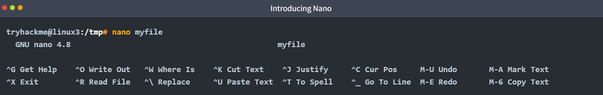

Then we can enter or modify text, navigating using the up and down arrow keys or start a new line using Enter.

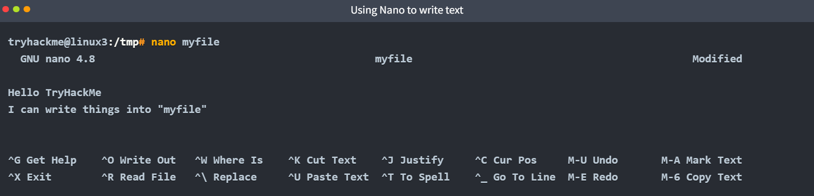

Nano has a few features that are easy to remember and covers the most general things you'd want out of a text editor, including:

- Searching for text
- Copying and pasting
- Jumping to a line number
- Finding out what line number you're on

You can use these features by pressing the "**Ctrl**" key (represented by `^` on Linux) and a corresponding letter. All shortcuts are displayed at the bottom of the terminal window.

### VIM

VIM is a much more advanced text editor and it's helpful to be aware of it.

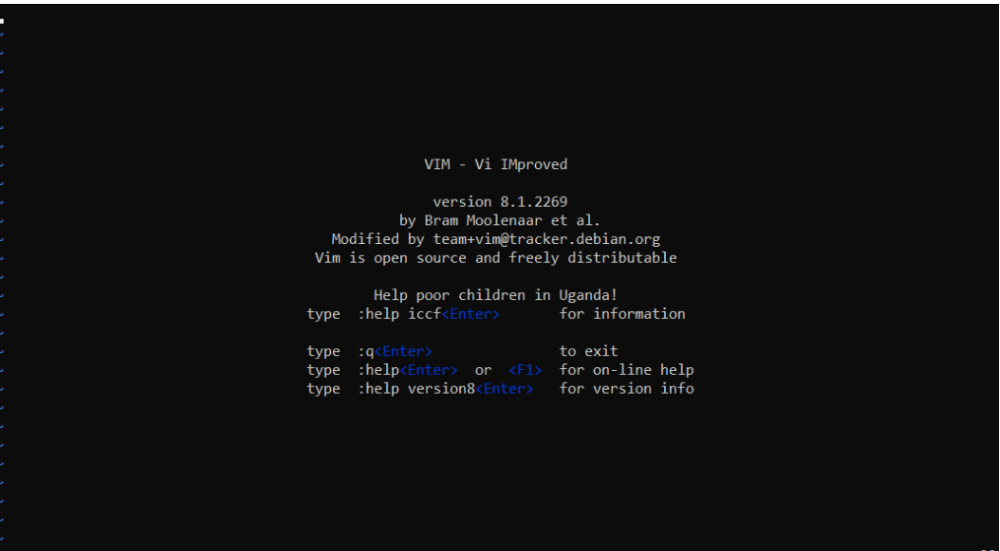

Some of VIM's benefits includes:

- Customisable - you can modify the keyboard shortcuts to be of your choosing
- Syntax highlighting - useful when writing or maintaining code
- Works on all terminals where nano may not be installed
- Lots of resources, such as [cheatsheets](https://vim.rtorr.com/), tutorials, and more

## General/Useful Utilities

We can use commands within Linux to download files from the web, transfer files from your host, or host a web server on our computer.

### Download Files

Can download files from the web via HTTP using `wget`, as if you were accessing the file in your browser. i.e. `wget https://assets.tryhackme.com/additional/linux-fundamentals/part3/myfile.txt`

### Transfer Files From Your Host

Secure copy, or SCP, is a means of securely copying files, allowing you to transfer files between two computers using the SSH protocol to provide both authentication and encryption.

Working on a model of SOURCE & DESTINATION, SCP allows you to:

- Copy files and directories from your current system to a remote system
- Copy files and directories from a remote sytem to your current sytem

Provided that we know usernames and passwords for a user on your current system and a remote system. i.e. `scp scp important.txt ubuntu@192.168.1.30:/home/ubuntu/transferred.txt`

### Serving Files From Your Host

Ubuntu machines come pre-packaged with python3, which provides a lightweight and easy-to-use module called "[HTTPServer](https://docs.python.org/3/library/http.server.html)". This module turns your computer into a web server that you can use to server your own files, where they can then be downloaded by another computer using commands such as `curl` and `wget`.

Python3's "HTTPServer" will serve the fies in the directory where you run the command, but this can be changed by providing options that can be found within the manual. Just run `python3 -m http.server` in the terminal to start the module.

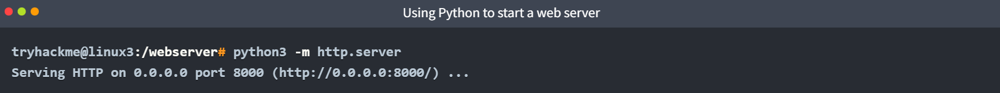

After starting server, can use wget to download the file using the IP address and name of the file.

You need to open a new terminal to use `wget` and leave the one the server started on open.

One flaw with this module is that you have no way of indexing, so you must know the exact name and location of the file that you wish to use. This is why using [Updog](https://github.com/sc0tfree/updog) may be preferred, which is a more advanced yet lightweight webserver.

## Processes

Processes are the programs that are running on your machine, which are managed by the kernel where each process will have an ID associated with it, also known as a PID. The PID increments for the order in which the process starts.

### Viewing Processes

We can use the `ps` command to provide a list of the running processes as our user's session and some additional information, such as its status code, the session that it's running in, how much usage time of the CPU it is using, and the name of the program or command that is being executed.

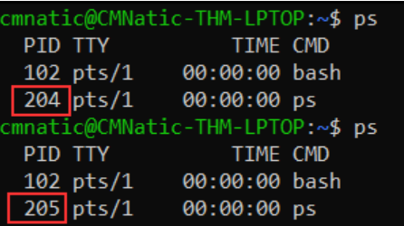

To see the processes run by other users and those that don't run from a session (i.e. system processes), we need to use `ps aux`.

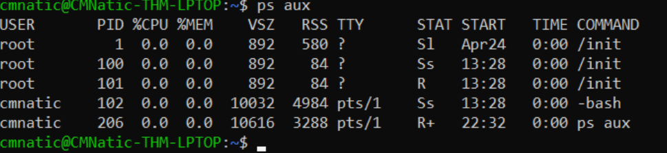

Another very useful command is the `top` command, which provides real-time statistics about the processes running on your sy stem instead of a one-time view. The statistics refresh every 10 seconds, but also when using the arrow keys to browse the rows.

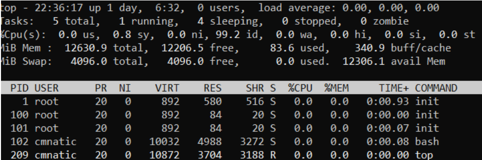

### Managing Processes

You can send signals that terminate processes; there are a variety of types of signals that correlate to exactly how "cleanly" the process is dealt with by the kernel. We can use the `kill` command nto kill a process by providing the associated PID, i.e. to kill PID 1337 we'd use `kill 1337`.

Some of the signals that we can send to a process when it's killed are:

- SIGTERM - Kill the process,but allow it to do some cleanup tasks beforehand
- SIGKILL - Kill the process; doesn't do any cleanup after the fact
- SIGSTOP - Stop/suspend a process

### Getting Processes/Services to Start on Boot

Some applications can be started on the boot of the system that we own, i.e. web servers, database servers, or file transfer servers. This software is often critical and told tos tart during the boot-up of the system by administrators.

The use of `systemctl` allows us to interact with the `systemd` process/daemon (the first process with PID 0 on startup). For example, to tell apache to start up, we'll use `systemctl start apache2`.

We can do four options with `systemctl`:

1. Start
2. Stop
3. Enable
4. Disable

### An Introduction to Backgrounding and Foregrounding in Linux

Processes can run in two states: in the background and in the foreground.

- We can add the `&` operator to the command to get the ID of the process as it is running in the background. i.e. `echo "Hi THM" &`
- To bring a script to the foreground again, we can use the `fg` command.

### Maintaining Your System Using Process Automation

Users may want to schedule a certain action or task to take place after the system has booted. i.e. running commands, backing up files, or launching your favourite programs.

The `cron` process can be used for this purpose, but more specifically `crontabs`. Crontab is one of the processes that is started during boot, which is responsible for facilitating and managing cron jobs.

A crontab is a special file with formatting that is recognised by the cron process to execute each line step-by-step. Crontab requires six specific values:

| Value | Description                              |
| ----- | ---------------------------------------- |
| MIN   | What minute to execute at                |
| HOUR  | What hour to execute at                  |
| DOM   | What day of the month to execute at      |
| MON   | What month of the year to execute at     |
| DOW   | What day of the week to execute at       |
| CMD   | The actual command that will be executed |

#### Example

If we wish to backup "cmnatic"'s "Documents" every 12 hours, we should use the following command: `0 */12 * * * cp -R /home/cmnatic/Documents /var/backups/`. Asterisks are used where we don't care what the value is. We can use `crontab -e` to edit the cron process file.

## Package Management

When developers wish to submit software to the community, they will submit it to an "apt" repository. If approved, their programs and tools will be released into the wild. Two features of Linux shine here: User accessibility and the merit of open source tools.

When using the `ls` command on an Ubuntu Linux machine, thse files serve as the gatway/registry.

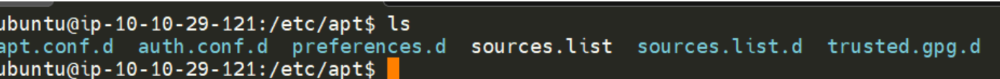

Additional repositories can be added using the `add-apt-repository` command.

### Managing Your Repositories

The `apt` command is a part of the package management software also named apt. Apt contains a whole suite of tools that allows us to manage the packages and sources of our software, and to install or remove software at the same time.

When adding software, the integrity of what we download is guaranteed by the use of GPG (Gnu Privacy Guard) keys, which are a safety check from the developers saying "here's our software".

To manually download Sublime Text 3, first we need to add the GPG key for the developers.

1. Download GPG key and use apt-key to trust it: `wget -qO - https://download.sublimetext.com/sublimehq-pub-gpg | sudo apt-key add -`

2. Now that we've added this key to our trusted list, we can add Sublime Text 3's repository to our apt sources list.
   1. Create a file named sublime-text.list in /etc/apt/sources.list.d
   2. Now use Nano or a text editor to add and save the Sublime Text 3 repository into this newly created file
   3. After we have added this entry, we need to update apt to recognise this new entry using the `apt-update` command
   4. Once successfully updated, we can now proceed to install the software that we have trusted and added to apt using `apt install sublime-text`

Removing packages is as easy as reversing this process, by using `add-apt-repository --remove ppa:PPa_Name/ppa` or manually deleting the file previously added. Once removed, we can use `apt remove [software-name-here]` i.e. `apt remove sublime-text`.

## Logs

Located in the /var/log directory, these files and folders contain logging information for applications and services running on your system. The OS has become pretty good at automatically managing these logs in a process known as 'rotating'.
